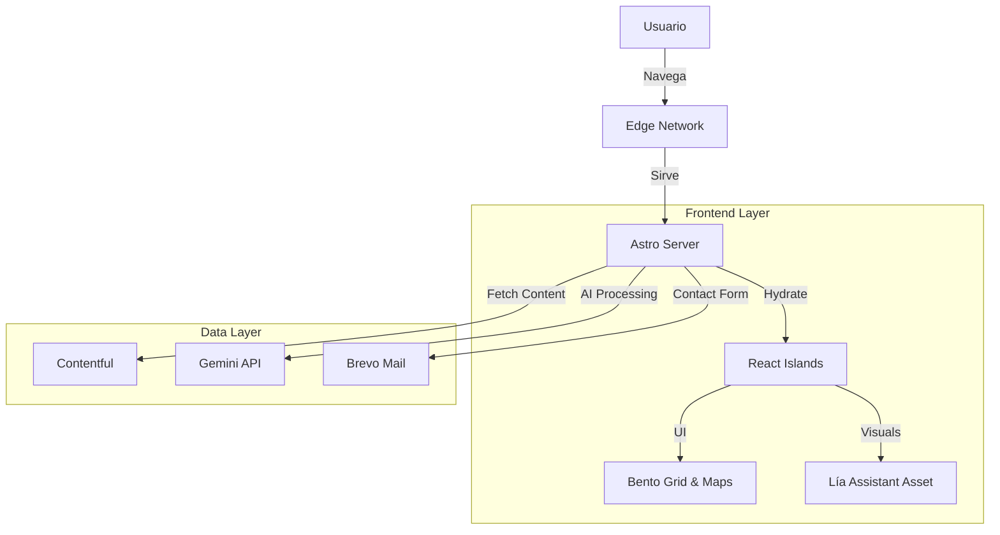

# 📱 Línea Digital Astro

> **Distribuidor Telcel Premium** — Plataforma corporativa de alto rendimiento con Astro, React Islands, Bento UI y Gemini AI para soluciones 5G y empresariales.

<!-- BADGES: Usa style=flat-square -->
[](https://astro.build)
[](https://react.dev)
[](https://tailwindcss.com)
[](https://telcel.com)

<p align="center">
  
</p>

---

## ✨ Características

| Característica      | Descripción                                                                  |
| :------------------ | :--------------------------------------------------------------------------- |
| 🚀 **Core Híbrido**  | Arquitectura de Islas con Astro + React para máximo rendimiento.             |
| 🤖 **Lía Assistant** | Identidad visual y asistente virtual integrada en la experiencia de usuario. |
| 🍱 **Bento Grid UI** | Diseño moderno y modular para presentar las 3 verticales de negocio.         |
| 📍 **Smart Maps**    | Sistema de localización interactivo estilo "Apple Maps" para sucursales.     |
| 🏢 **B2B & B2C**     | Flujos diferenciados para Clientes Personales, Empresas y Mayoristas.        |
| 🧠 **IA Integrada**  | Potenciado por Google Gemini API para funcionalidades inteligentes.          |

---

## 🚀 Inicio Rápido

### Requisitos
- Node.js v18+
- Claves de API: Contentful (CMS), Gemini (IA), Brevo (Mailing).

### 1. Clonar el repositorio
```bash
git clone https://github.com/herwingx/linea-digital-astro.git
cd linea-digital-astro
```

### 2. Configurar variables de entorno

Crea un archivo `.env` en la raíz del proyecto:

```bash
cp .env.example .env
```

Variables principales (`.env`):
```env
# Contentful CMS
CONTENTFUL_SPACE_ID=tu_space_id
CONTENTFUL_ACCESS_TOKEN=tu_access_token

# Google & AI Services
GOOGLE_API_KEY=tu_google_api_key
GOOGLE_PLACE_ID=tu_place_id
GEMINI_API_KEY=tu_gemini_key

# Mailing (SMTP & Brevo)
EMAIL_USER=usuario_smtp
EMAIL_PASS=password_smtp
EMAIL_HOST=mail.tudominio.com
BREVO_API_KEY=tu_brevo_key
BREVO_LIST_ID=id_lista
```

### 3. Iniciar la aplicación

```bash
npm install
npm run dev
```

## 📦 Opciones de Despliegue

| Método     | Archivo              | Ideal para                |
| :--------- | :------------------- | :------------------------ |
| **Docker** | `docker-compose.yml` | Producción / Contenedores |
| **Nativo** | `npm script`         | VPS / PM2                 |

📘 Ver guía completa: [docs/DEPLOYMENT.md](docs/DEPLOYMENT.md)

## 📦 Opciones de Despliegue

| Método     | Tecnología    | Descripción                                |
| :--------- | :------------ | :----------------------------------------- |
| **Básico** | Node.js + PM2 | Proceso nativo gestionado por PM2.         |
| **Apache** | Reverse Proxy | Integración con servidor Apache existente. |

📘 Ver guía completa: [docs/DEPLOYMENT.md](docs/DEPLOYMENT.md)

---

## 🏗️ Arquitectura



## 📦 Módulos de Negocio

| Vertical     | Descripción                                                     |
| :----------- | :-------------------------------------------------------------- |
| **Personas** | Catálogo de Smartphones, Planes de Renta y Amigo Kit.           |
| **Empresas** | Soluciones corporativas, Internet IoT y cotizadores masivos.    |
| **Socios**   | Plataforma para distribuidores y mayoristas (recargas/equipos). |

## 🛠️ Stack Tecnológico

**Frontend Experience**
- [Astro]: Renderizado estático y SSR.
- [React]: Mapas interactivos y componentes de estado complejo.
- [TailwindCSS]: Sistema de diseño Atomic con modo oscuro.
- [Swiper]: Carruseles táctiles para testimonios y equipos.

**Backend & Servicios**
- [Contentful]: Gestión de inventario y blog.
- [Google Gemini]: IA para generación de contenido dinámico.
- [Brevo]: Infraestructura transaccional de correos.

## 🤝 Contribuir
1. Fork del repositorio
2. Crear rama: `git checkout -b feat/nueva-feature`
3. Commit: `git commit -m "feat: descripción"`
4. Push: `git push origin feat/nueva-feature`
5. Crear Pull Request

## 📄 Licencia
Propiedad de **Línea Digital del Sureste**. Consultar derechos de uso.
