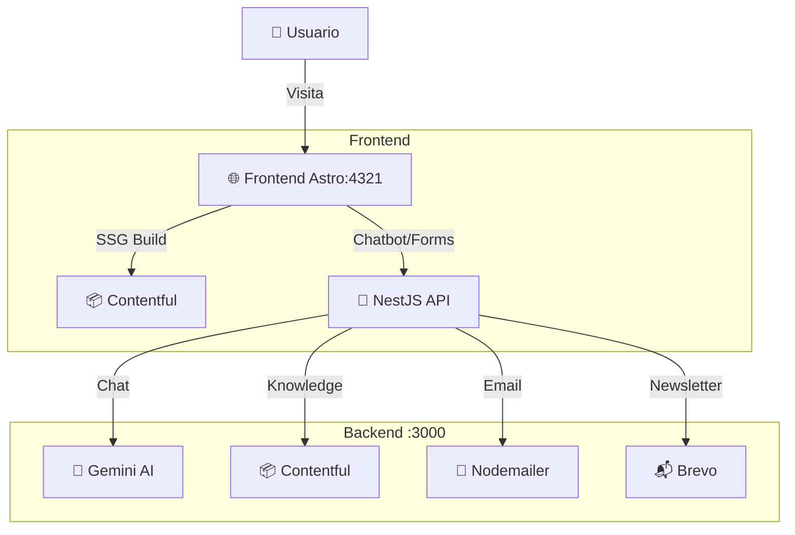

# 📱 Línea Digital Astro Monorepo

> **Distribuidor Telcel Premium** — Plataforma corporativa de alto rendimiento con Astro, NestJS, React y Gemini AI.

[](https://astro.build)
[](https://nestjs.com)
[](https://react.dev)
[](https://tailwindcss.com)
[](https://contentful.com)

<p align="center">
  
</p>

---

## 🏗️ Arquitectura Monorepo (2026)

Este proyecto utiliza una arquitectura **monorepo** con NPM Workspaces para separar claramente las responsabilidades entre Frontend y Backend.

```
linea-digital-astro/
├── apps/
│   ├── frontend/    # 🌐 Sitio Web (Astro + React)
│   └── backend/     # 🔧 API (NestJS)
├── package.json     # Monorepo root con workspaces
└── README.md        # Este archivo
```

| Aplicación | Tecnología | Puerto | Responsabilidad |
|------------|------------|--------|-----------------|
| **Frontend** | Astro + React + Tailwind | `4321` | UI, SEO, UX, páginas estáticas |
| **Backend** | NestJS + TypeScript | `3000` | APIs, AI, Email, seguridad |

---

## 🎯 ¿Por qué esta arquitectura?

### Problema Anterior (Monolito Astro)
- ❌ API Keys de Gemini/Brevo expuestas en cliente
- ❌ Rate limits imposibles de controlar
- ❌ Sin documentación de APIs
- ❌ Lógica duplicada entre páginas

### Solución Actual (Monorepo)
- ✅ **Seguridad**: Claves sensibles solo en el servidor
- ✅ **Escalabilidad**: Backend puede escalar independientemente
- ✅ **Documentación**: Swagger automático en `/api/docs`
- ✅ **Rendimiento**: Frontend estático + API bajo demanda
- ✅ **Desarrollo**: Hot reload independiente para cada app

---

## 🚀 Inicio Rápido

### Requisitos
- Node.js v18+
- NPM 9+ (Soporte Workspaces)

### 1. Clonar e Instalar

```bash
git clone https://github.com/herwingx/linea-digital-astro.git
cd linea-digital-astro
npm install
```

### 2. Configurar Variables de Entorno

**Frontend** (`apps/frontend/.env`):
```env
PUBLIC_API_URL=http://localhost:3000
CONTENTFUL_SPACE_ID="tu_space_id"
CONTENTFUL_ACCESS_TOKEN="tu_token"
GOOGLE_API_KEY="tu_maps_key"
GOOGLE_PLACE_ID="tu_place_id"
```

**Backend** (`apps/backend/.env`):
```env
CONTENTFUL_SPACE_ID="tu_space_id"
CONTENTFUL_ACCESS_TOKEN="tu_token"
GEMINI_API_KEY="tu_gemini_key"
EMAIL_HOST="mail.tudominio.com"
EMAIL_PORT="587"
EMAIL_USER="usuario"
EMAIL_PASS="password"
EMAIL_FROM="noreply@tudominio.com"
EMAIL_TO="destino@tudominio.com"
BREVO_API_KEY="xkeysib-..."
BREVO_LIST_ID="3"
```

### 3. Ejecutar

```bash
# 🚀 Iniciar TODO (Frontend + Backend simultáneamente)
npm run dev

# Solo Frontend
npm run dev:frontend

# Solo Backend
npm run dev:backend
```

---

## 📊 Diagrama de Flujo



---

## 📁 Estructura de Carpetas

```
apps/
├── backend/
│   └── src/
│       ├── chat/          # 🤖 Chatbot Lía (Gemini AI)
│       ├── contentful/    # 📦 CMS Endpoints
│       ├── email/         # 📧 Contact + Newsletter
│       └── main.ts        # Bootstrap + Swagger
│
└── frontend/
    └── src/
        ├── components/    # UI Components
        ├── layouts/       # Base layouts
        ├── lib/           # Chatbot client
        ├── pages/         # Rutas Astro
        ├── services/      # Contentful client (SSG)
        └── styles/        # Tailwind + CSS
```

---

## 🔌 API Endpoints (Backend)

### Chat
| Método | Ruta | Descripción |
|--------|------|-------------|
| `POST` | `/chat` | Chatbot Lía con Gemini AI |

### Email
| Método | Ruta | Descripción |
|--------|------|-------------|
| `POST` | `/email/send` | Formulario de contacto |
| `POST` | `/email/subscribe` | Newsletter (Brevo) |

### Contentful
| Método | Ruta | Descripción |
|--------|------|-------------|
| `GET` | `/content/promos` | Promociones activas |
| `GET` | `/content/planes/libre` | Planes Libre |
| `GET` | `/content/planes/ultra` | Planes Ultra |
| `GET` | `/content/planes/casa-libre` | Internet en Casa |
| `GET` | `/content/knowledge` | Todo para chatbot |

📘 **Documentación Swagger**: `http://localhost:3000/api/docs`

---

## 🛠️ Scripts Disponibles

| Comando | Descripción |
|---------|-------------|
| `npm run dev` | Inicia Frontend + Backend |
| `npm run dev:frontend` | Solo Frontend (Astro) |
| `npm run dev:backend` | Solo Backend (NestJS) |
| `npm run build` | Build de ambos proyectos |

---

## 🧩 Stack Tecnológico

### Frontend
- **Astro 5** — SSG/SSR ultrarrápido
- **React 18** — Componentes interactivos
- **TailwindCSS** — Utilidades CSS
- **Contentful SDK** — Datos en build time

### Backend
- **NestJS 10** — Framework empresarial
- **TypeScript** — Tipado estricto
- **Swagger** — Documentación automática
- **Google Generative AI** — Gemini 1.5 Flash
- **Nodemailer** — SMTP emails
- **Brevo SDK** — Marketing automation

---

## 📚 Documentación Adicional

- 📖 [Frontend README](./apps/frontend/README.md)
- 📖 [Backend README](./apps/backend/README.md)

---

## 👥 Equipo

Desarrollado por el equipo de tecnología de **Línea Digital del Sureste**.

## 📄 Licencia

Propiedad privada de **Línea Digital del Sureste**. Todos los derechos reservados.
